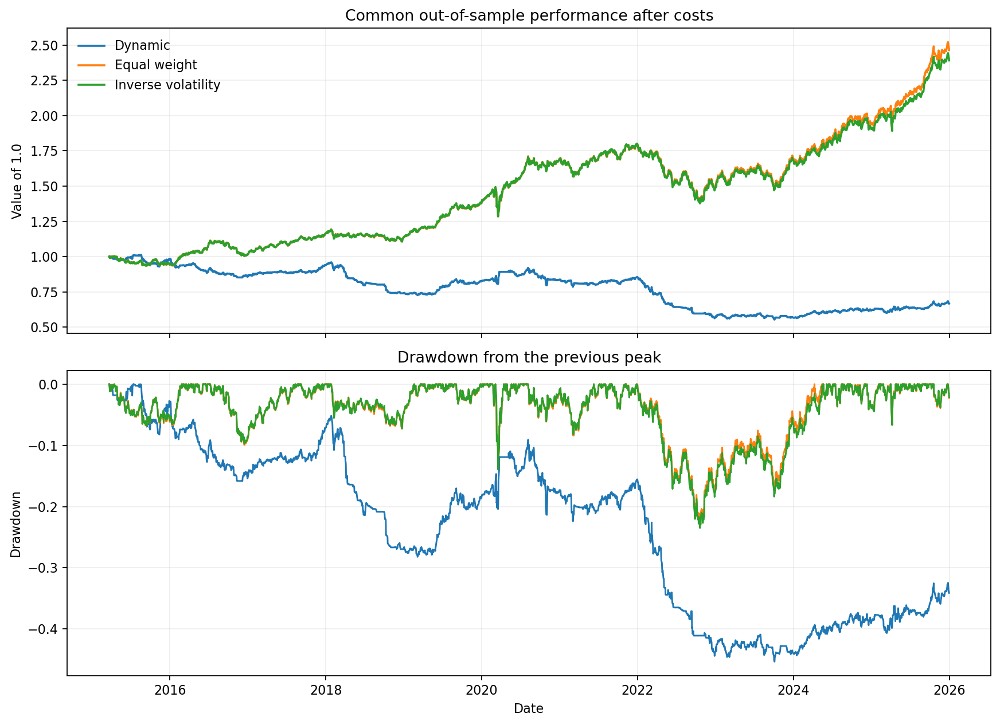
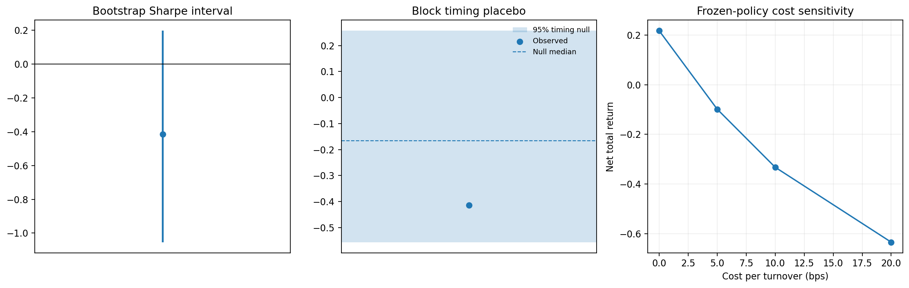
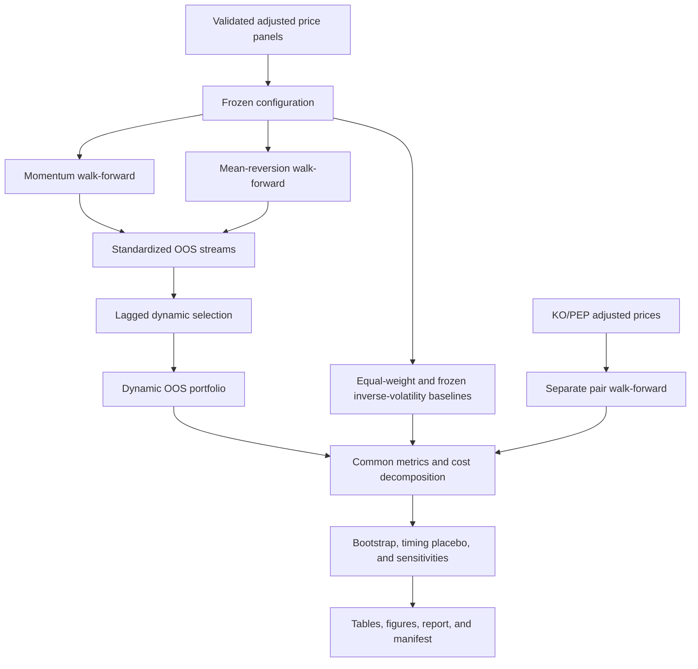
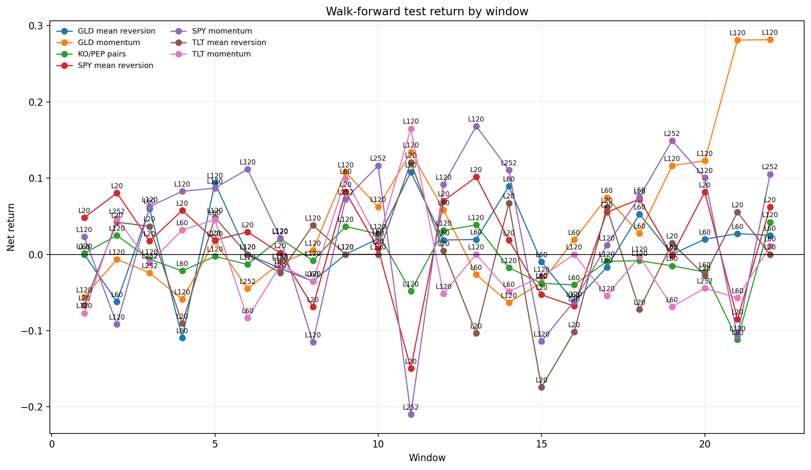
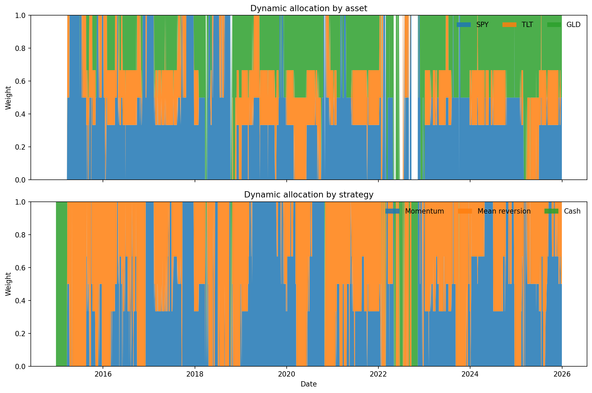

# Chronological Quant Research System

This project asks a simple question: can several trading ideas be selected without future information, tested repeatedly out of sample, and combined into a dynamic portfolio that improves on simpler alternatives after costs?

The answer from the frozen final experiment is **no**. That is the useful result. The dynamic allocator was mildly profitable before costs, but frequent strategy switching created enough turnover to make it substantially worse than equal-weight and inverse-volatility baselines.

## Thirty-second summary

- Daily adjusted-close data for SPY, TLT, GLD, KO, and PEP from 2010 through 2025.
- Momentum and mean-reversion strategies on SPY, TLT, and GLD.
- A separate KO/PEP pairs strategy with pre-test-frozen regressions.
- Expanding chronological train/validation/test windows with actual positions carried across test boundaries.
- A dynamic allocator whose score is lagged by one day and built only from walk-forward test returns.
- Separate underlying strategy costs and dynamic allocation-overlay costs.
- Frozen cost sensitivity, stationary-bootstrap intervals, and a block timing-placebo test.
- One command produces all final tables, four figures, a report, and a reproducibility manifest.
- 354 automated tests.

## Final result

The primary common out-of-sample period is 23 March 2015 through 31 December 2025. Results below include the configured 10-basis-point cost per unit of gross-notional turnover.

| System | Net return | Annual return | Volatility | Sharpe | Max drawdown |
|---|---:|---:|---:|---:|---:|
| Dynamic portfolio | -33.26% | -3.69% | 8.24% | -0.41 | -45.34% |
| Equal weight | 146.44% | 8.74% | 9.48% | 0.93 | -22.86% |
| Frozen inverse volatility | 139.15% | 8.44% | 9.45% | 0.90 | -23.51% |
| GLD momentum | 143.96% | 8.64% | 12.36% | 0.73 | -21.58% |
| SPY momentum | 73.67% | 5.26% | 12.72% | 0.47 | -31.58% |
| KO/PEP pairs (separate OOS period) | -14.31% | -1.39% | 5.84% | -0.21 | -26.20% |

The dynamic portfolio returned 21.73% with trading costs set to zero, but returned -33.26% at the frozen 10-basis-point assumption. Its total gross-notional turnover was 600.74, of which 511.24 came from the allocation overlay. In other words, the selection rule traded far too often for its weak pre-cost edge.

The primary stationary-bootstrap interval for the dynamic Sharpe was **[-1.05, 0.20]**. The block timing-placebo p-value was **0.896**, so the observed timing was not stronger than the broken-timing null. The primary hypothesis was not supported.





A negative result is not hidden or tuned away here. The purpose of the project is the research process: causal timing, chronological selection, cost accounting, reproducibility, and an honest conclusion.

## How the system fits together



Pairs remain separate because a beta-changing two-leg spread does not fit cleanly into the long/cash per-asset sleeve allocator. Combining them properly would require an asset-level holdings and netting engine, which is outside this project’s scope.

## Preventing look-ahead bias

Four rules matter most:

1. **Signals are delayed.** Information observed on day `t` creates the position that earns the `t` to `t+1` return.
2. **Warm-up is not performance.** Earlier rows may calculate rolling state, but only the requested validation or test rows are scored.
3. **Selection is chronological.** Training ranks the grid, validation selects among the surviving candidates, and the following test window is untouched by that selection.
4. **Dynamic inputs are OOS-only.** The final allocator accepts standardized walk-forward test streams, aligns their dates, shifts its rolling score, and begins the primary comparison only after its 60-day warm-up.

At every new test window, the chosen parameter may imply a different desired position. Turnover is calculated against the actual position carried from the previous test window, not against a hypothetical position generated by replaying the newly selected rule through old data.

## Methodology

### Walk-forward design

The frozen configuration uses an expanding history:

- initial training: 1,000 observations;
- validation: 252 observations;
- test: 126 observations;
- 22 complete test windows;
- incomplete trailing rows are excluded and recorded in the run manifest.

Momentum tests lookbacks of 20, 60, 120, and 252 days. Mean reversion tests lookbacks of 20, 60, and 120 days with predeclared entry and exit thresholds. Training keeps only the configured top candidates; validation chooses among those exact candidates rather than inventing a new parameter combination.



### Strategies

Momentum is long when the lookback return is positive and otherwise holds cash:

```text
lookback_return[t] = price[t] / price[t-lookback] - 1
position[t+1] = 1 if lookback_return[t] > 0 else 0
```

Mean reversion uses a rolling price z-score and a stateful entry/exit rule. It enters after a sufficiently negative deviation and remains invested until the exit threshold is crossed.

Pairs models:

```text
CloseA = alpha + beta * CloseB + spread
```

Alpha and beta are estimated only from rows available before the evaluated validation or test period. Pair P&L uses both legs, normalizes by previous gross exposure, and charges turnover when either normalized leg changes. KO/PEP is predefined; pre-test cointegration diagnostics are reported as evidence and are not used to replace the pair after viewing OOS performance.

### Portfolios and costs

The static baselines are equal weight and inverse volatility. Inverse-volatility weights are estimated from pre-OOS returns and frozen before evaluation.

For each asset, the dynamic allocator compares the lagged 60-day risk-adjusted scores of its momentum and mean-reversion OOS streams. It selects the stronger positive score, divides capital equally across active assets, and holds unused capital in cash.



The cost model is deliberately simple:

```text
cost[t] = gross_notional_turnover[t] * cost_rate
net_return[t] = gross_return[t] - cost[t]
```

Candidate trading costs and the extra allocation-overlay cost are stored separately. This is a sleeve abstraction, not exact single-account netting, so some switches may be charged conservatively at both layers.

### Robustness

The final run includes:

- 5,000 stationary-bootstrap resamples for daily mean return and Sharpe;
- half, primary, and double expected block-length variants;
- a fixed random seed recorded in the manifest;
- one aligned block timing-placebo test;
- frozen-policy costs at 0, 5, 10, and 20 basis points;
- parameter selection frequency and validation rank summaries;
- return, volatility, turnover, cost, activity, and profit-concentration summaries for every test window.

The cost sensitivity never re-optimizes parameters or recalculates allocation decisions. Only the cost charged to the already frozen positions and weights changes.

## Reproduce the project

Python 3.11–3.13 is supported.

```bash
python -m venv .venv
source .venv/bin/activate
python -m pip install --upgrade pip
python -m pip install -r requirements.txt
```

Download fresh adjusted-price inputs:

```bash
python download_data.py
```

Run the tests and frozen experiment:

```bash
python -m pytest -q
python run_research.py --config config/default.json
```

The research command creates:

```text
output/
├── run_manifest.json
├── oos_strategy_streams.csv
├── dynamic_portfolio.csv
├── walk_forward_windows.csv
├── summary_metrics.csv
├── bootstrap_intervals.csv
├── randomisation_tests.csv
├── cost_sensitivity.csv
├── parameter_stability.csv
├── final_report.md
└── figures/
    ├── oos_performance.png
    ├── walk_forward_stability.png
    ├── dynamic_allocation.png
    └── robustness.png
```

`output/` is ignored because it is regenerated. A curated snapshot of the frozen release is stored in `reports/`.

The manifest records the full configuration, data and config hashes, package versions, random seed, Git commit and dirty state, OOS dates, unused trailing rows, and hashes of every output artifact.

## Data

`download_data.py` retrieves adjusted closes through [yfinance](https://ranaroussi.github.io/yfinance/reference/api/yfinance.download.html) with `auto_adjust=True` and builds complete intersection calendars. The configured range is 1 January 2010 to 1 January 2026; the end date is exclusive, so the last possible observation is 31 December 2025.

Downloaded market data is ignored rather than redistributed. Exact input hashes for the published result are in the [frozen run manifest](reports/run_manifest.json). See [data/README.md](data/README.md) for the schema, provenance, and missing-data rules.

## Testing

The repository currently has 354 passing tests. They cover formulas and input validation as well as behavioral failures that are easy to miss in backtests:

- first deployment from cash and parameter changes at window boundaries;
- pair beta changes and leg-level turnover;
- future-data perturbation invariance;
- strict common-calendar and OOS-provenance rules;
- missing-data and wealth guards;
- metric consistency across strategy families;
- bootstrap reproducibility and edge cases;
- predictive and non-predictive timing-placebo behavior;
- frozen cost sensitivity;
- a full synthetic pipeline artifact smoke test.

GitHub Actions runs the same suite on supported Python versions.

## Limitations

- Daily close execution is idealized. The model observes close `t`, transacts at that close, and earns the next close-to-close return.
- Costs are proportional and omit spreads, market impact, borrow fees, taxes, capacity, and slippage variation.
- A zero risk-free rate and 252 trading periods per year are assumed.
- The project does not model asset-level netting across sleeves.
- This historical OOS sequence was visible during earlier project development, so it is not a pristine institutional holdout.
- Bootstrap intervals describe uncertainty conditional on this design; they do not prove alpha or correct for every research choice.
- Historical Yahoo adjustments can change. The manifest identifies the exact files used for a run.

This is a research and backtesting project, not investment advice or a live trading system.

## Repository map

```text
config/default.json       Frozen experiment definition
download_data.py          Reproducible adjusted-price download
run_research.py           One-command final pipeline
src/data.py               Shared validation and data contracts
src/metrics.py            Shared performance metrics
src/*_optimise.py         Chronological candidate evaluation
src/*_walk_forward.py     Expanding-window OOS evaluation
src/integration.py        Standardized streams, baselines, and dynamic portfolio
src/robustness.py         Bootstrap and timing placebo
src/sensitivity.py        Cost, window, and parameter stability
src/reporting.py          Tables, figures, and final report
tests/                    Unit, behavioral, and end-to-end tests
reports/                  Curated frozen output snapshot
```

The full frozen result and its assumptions are in [reports/final_report.md](reports/final_report.md).
